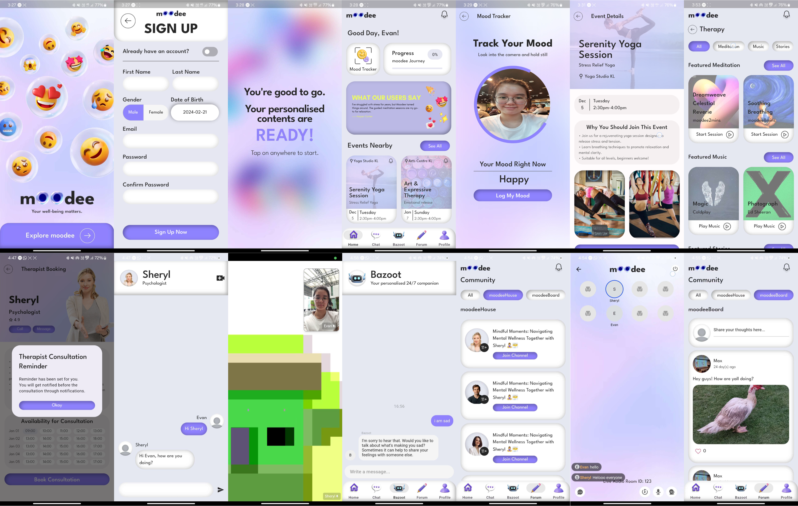

# moodee

Moodee, our pioneering mental health app redefining mental health care accessibility and support for individuals navigating mental health challenges. Moodee is a comprehensive platform crafted to empower users in their journey towards achieving mental well-being. Our aim is to shatter access barriers, foster community support, and provide tools for proactive self-care. By offering a holistic approach to mental health, Moodee endeavors to ensure that everyone, regardless of their background or circumstances, can access the support they need to thrive.

## Application Overview

YouTube Video Link: [https://youtu.be/zFLTuYzq2FU?si=sYf2cLLqwjtHo6um](https://youtu.be/zFLTuYzq2FU?si=sYf2cLLqwjtHo6um)

The World Health Organization underscores the crucial role of mental health in overall well-being, yet a significant treatment gap exists globally, particularly in low and middle-income countries due to stigma and fragmented support services. To address these challenges, there's a need to combat stigma, advocate for mental health as a human right, and develop unified, accessible platforms. Enter Moodee, a pioneering mental health app designed to break down access barriers, foster community support, and provide tools for proactive self-care, aiming to ensure everyone can access the support they need to thrive.

Moodee aligns its mission with three United Nations' Sustainable Development Goals (SDGs) to promote a healthier and more inclusive society. Firstly, it supports SDG 3 by bridging the gap in mental health support, offering accessible services through therapist matching and community forums. Secondly, Moodee contributes to SDG 4 by promoting mental health education and awareness through tools like mood tracking and guided meditation, fostering proactive mental health care. Lastly, it aligns with SDG 10 by prioritizing accessibility to mental health services, especially for marginalized groups, ensuring inclusivity and support for all individuals.

Moodee offers a comprehensive suite of features to empower users in managing their mental well-being effectively. These include therapist matching and booking, AI mood tracking with facial recognition, guided meditation, curated stories and music playlists, and a vibrant community platform called MoodeeHouse, which features voice channels for discussion sessions hosted by therapists, speakers, and counselors, along with MoodeeBoard, support forums for user-generated posts and discussions. Additionally, users can discover nearby group therapy events. With its user-friendly interface and diverse features, Moodee aims to break down barriers to access, foster community support, and provide tools for proactive self-care, thereby enabling individuals to take control of their mental well-being.

## Getting Started
1. Download the source code folder and unzip
2. Open the source code folder on your preferred IDE (Visual Studio Code Recommended)
3. Run the source code on any physical / virtual device, online documentation (Preferred to use Pixel 7 Pro & Pixel 8 Pro AVD).
4. Start navigating and using the application's features.
5. If in any case there is an error due to a bad state, please refresh the app as the connection may not be good to retrieve data from firebase.

## Moodee Mobile App Features:
- Personalised Contents 
- AI Mood Tracker with Facial Recognition
- In-App Therapy Sessions
  - Booking and Reminder System
  - Chat or Video Call Therapy Session
- AI-Powered Therapist (Bazoot AI)
- In-App Therapy Features
  - Guided Meditation Playlists
  - Curated Stories Playlists
  - Music Playlists
- Moodee Community Platform
  - MoodeeHouse: features voice channels for discussion sessions hosted by therapists, speakers, and counselors
  - MoodeeBoard: support forums for user-generated posts and discussions
- Nearby Group Therapy Events with Reminder System
- Seamless Sign Up / Login With Firebase Authentication

## Moodee's Solution Architecture:
  - Figma for UI/UX design for presenting the app's interface.
  - Flutter for front-end development.
  - Cloud Firestore, Firebase Storage, Firebase Authentication, Firebase Cloud Messaging for backend architecture. 
  - Incorporates APIs such as Gemini for AI Therapist Chatbot, ZegoCloud for virtual appointments or support group meetings, and Google Maps for locating therapy sessions.
  - Additional APIs include Firebase Authentication for authentication, Firebase Firestore for database, Firebase Functions for push notifications, HTTP packages for backend connectivity, and Riverpod for app-wide state management.
  - Tensorflow utilized for mood tracking based on facial recognition models.
    

## Technologies

- **UI:** 
  - Cupertino Icons: `cupertino_icons: ^1.0.2`
  - Flutter Inset Box Shadow: `flutter_inset_box_shadow: ^1.0.8`
  - Bulleted List: `bulleted_list: ^0.0.1+0.1a`
  - Rive: `rive: ^0.12.4`
  - Table Calendar: `table_calendar: ^3.0.9`
  - Flutter Launcher Icons: `flutter_launcher_icons: ^0.9.3`
  - Dash Chat 2: `dash_chat_2: ^0.0.19`
  - Carousel Slider: `carousel_slider: ^4.2.1`
  - Animated Text Kit: `animated_text_kit: ^4.2.2`
  - Google Fonts: `google_fonts: ^6.2.1`

- **Firebase Integration:** 
  - Firebase Core: `firebase_core: ^2.24.2`
  - Firebase Auth: `firebase_auth: ^4.16.0`
  - Cloud Firestore: `cloud_firestore: ^4.14.0`
  - Firebase Storage: `firebase_storage: ^11.6.0`
  - Firebase Messaging: `firebase_messaging: ^14.7.10`

- **State Management:** 
  - Provider: `provider: ^6.1.1`

- **Device Feature:** 
  - Camera: `camera: ^0.10.5+9`
  - Image Picker: `image_picker: ^0.8.4+4`

- **Machine Learning:** 
  - TFLite Flutter: `tflite_flutter: ^0.10.1`
  - Flutter TFLite: `flutter_tflite: ^1.0.1`

- **AI Integration:** 
  - ChatGPT SDK: `chat_gpt_sdk: ^2.2.8`

- **Utility:** 
  - UUID: `uuid: ^4.3.3`

- **Internationalization:** 
  - Intl: `intl: ^0.18.1`

- **Other:** 
  - Google Generative AI: `google_generative_ai: ^0.3.2`
  - Audio Video Progress Bar: `audio_video_progress_bar: ^2.0.1`
  - Spotify: `spotify: ^0.13.6+1`
  - YouTube Explode Dart: `youtube_explode_dart: ^2.0.2`
  - Audioplayers: `audioplayers: ^5.2.1`
  - Palette Generator: `palette_generator: ^0.3.3+3`
  - Scrollable Positioned List: `scrollable_positioned_list: ^0.3.8`
  - Pie Chart: `pie_chart: ^5.4.0`
  - Collection: `collection: ^1.1.0`

## App Screenshot

## Contributors
- [Sanjivrajah Murali](https://github.com/sanchick02)
- [Heng Claudia](https://github.com/claudiaheng13)
- [Lim Chuan Zhe](https://github.com/ehznauhcmil)

